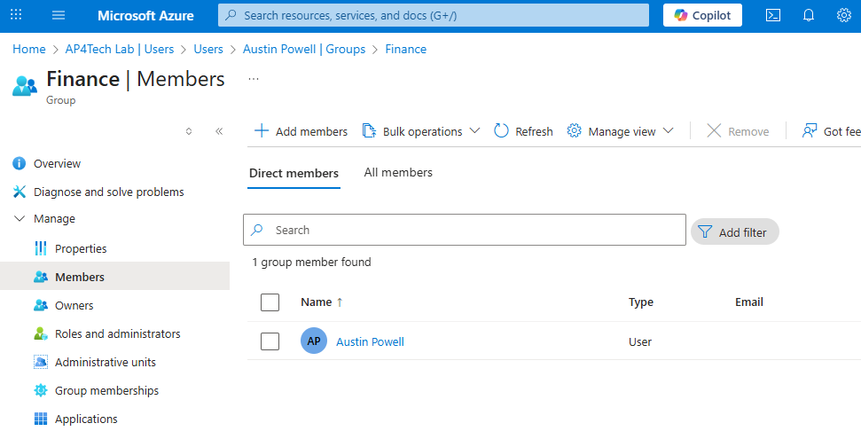

# 🛡️ IAM Lifecycle Automation Project

This project replicates a **real-world Identity and Access Management (IAM)** environment using free tools like Azure Entra ID and Okta. It simulates user provisioning through SCIM-like workflows, multi-factor authentication (MFA), SAML-based single sign-on (SSO), and lifecycle automation using an HR data source.

---

## 🧰 Tools Used
- **Azure Entra ID**
- **Okta**
- **Excel (simulating HR system)**
- **SCIM-style provisioning**


---

## ⚙️ What This Project Covers

### 🔄 Lifecycle Automation
- HR adds user in Excel (HR system/ ex. Workday)
- User is created in IDP (Entra ID or Okta)
- Group assignment & app access automated

### 🔐 Access Governance
- MFA policies & Conditional Access
- SSO with SAML
- Least Privilege & Access Reviews

### 🔁 SCIM Provisioning (Simulated)
Provisioning based on department:
- Finance users → Finance group → Finance apps

---

## 🧾 IAM Lab Summary

### 🔹 Azure / Entra ID
- Created users
- Assigned security groups
- Enforced MFA
- Built conditional access policies

### 🔹 Okta
- Created users/groups
- Enabled MFA with Okta Verify
- Configured SSO (SAML)
- Created custom attribute: `departmentCode`

 
 ## 📸 Project Screenshot Overview

The following screenshot provides a high-level view of the Identity and Access Management (IAM) lifecycle flow implemented in this simulation project. It highlights key steps across both Entra ID and Okta:

### 🔹 User Created in Entra ID


### 🔹 Group Assignment + Access


### 🔹 MFA Setup


### 🔹 SSO Config in Okta


## 📂 Project Structure

The repository is organized as follows:

```bash
📁 iam-lifecycle-simulation-scim-entra-okta/
├── README.md                          # Project overview and documentation
├── user_data.csv                      # Sample input data for identity provisioning
├── provisioning_steps.md              # Step-by-step notes for SCIM provisioning flow
├── screenshots/
│   └── iam-summary.png                # Combined IAM screenshots (Entra ID & Okta)

